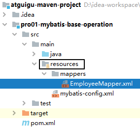

[TOC]

# 第一节 HelloWorld

## 1、物理建模

```sql
CREATE DATABASE `mybatis-example`;

USE `mybatis-example`;

CREATE TABLE `t_emp`(
emp_id INT AUTO_INCREMENT,
emp_name CHAR(100),
emp_salary DOUBLE(10,5),
PRIMARY KEY(emp_id)
);

INSERT INTO `t_emp`(emp_name,emp_salary) VALUES("tom",200.33);
```


## 2、逻辑建模

### ①创建Maven module


### ②创建Java实体类

> 实体类是和现实世界中某一个具体或抽象的概念对应，是软件开发过程中，为了管理现实世界中的数据而设计的模型。
>
> 实体类的多个不同的叫法：
>
> domain：领域模型
>
> entity：实体
>
> POJO：Plain Old Java Object
>
> Java bean：一个Java类

```java
/**
 * 和数据库表t_emp对应的实体类
 * emp_id INT AUTO_INCREMENT
 * emp_name CHAR(100)
 * emp_salary DOUBLE(10,5)
 *
 * Java的实体类中，属性的类型不要使用基本数据类型，要使用包装类型。因为包装类型可以赋值为null，表示空，而基本数据类型不可以。
 */
public class Employee {
    
    private Integer empId;
    
    private String empName;
    
    private Double empSalary;
    
    public Employee() {
    
    }
    
    public Integer getEmpId() {
        return empId;
    }
    
    public void setEmpId(Integer empId) {
        this.empId = empId;
    }
    
    public String getEmpName() {
        return empName;
    }
    
    public void setEmpName(String empName) {
        this.empName = empName;
    }
    
    public Double getEmpSalary() {
        return empSalary;
    }
    
    public void setEmpSalary(Double empSalary) {
        this.empSalary = empSalary;
    }
    
    @Override
    public String toString() {
        return "Employee{" +
                "empId=" + empId +
                ", empName='" + empName + '\'' +
                ", empSalary=" + empSalary +
                '}';
    }
    
    public Employee(Integer empId, String empName, Double empSalary) {
        this.empId = empId;
        this.empName = empName;
        this.empSalary = empSalary;
    }
}
```


## 3、搭建框架开发环境

### ①导入依赖

```xml
<dependencies>
    <!-- Mybatis核心 -->
    <dependency>
        <groupId>org.mybatis</groupId>
        <artifactId>mybatis</artifactId>
        <version>3.5.7</version>
    </dependency>
    
    <!-- junit测试 -->
    <dependency>
        <groupId>junit</groupId>
        <artifactId>junit</artifactId>
        <version>4.12</version>
        <scope>test</scope>
    </dependency>
    
    <!-- MySQL驱动 -->
    <dependency>
        <groupId>mysql</groupId>
        <artifactId>mysql-connector-java</artifactId>
        <version>5.1.3</version>
    </dependency>
    
    <!-- 数据源 -->
    <dependency>
        <groupId>com.alibaba</groupId>
        <artifactId>druid</artifactId>
        <version>1.0.31</version>
    </dependency>
</dependencies>
```


### ②准备配置文件

#### [1]Mybatis全局配置文件

习惯上命名为mybatis-config.xml，这个文件名仅仅只是建议，并非强制要求。将来整合Spring之后，这个配置文件可以省略，所以大家操作时可以直接复制、粘贴。

```xml
<?xml version="1.0" encoding="UTF-8" ?>
<!DOCTYPE configuration
        PUBLIC "-//mybatis.org//DTD Config 3.0//EN"
        "http://mybatis.org/dtd/mybatis-3-config.dtd">
<configuration>
    
    <!-- environments表示配置Mybatis的开发环境，可以配置多个环境，在众多具体环境中，使用default属性指定实际运行时使用的环境。default属性的取值是environment标签的id属性的值。 -->
    <environments default="development">
        <!-- environment表示配置Mybatis的一个具体的环境 -->
        <environment id="development">
    
            <!-- Mybatis的内置的事务管理器 -->
            <transactionManager type="JDBC"/>
    
            <!-- 配置数据源 -->
            <dataSource type="POOLED">
    
                <!-- 建立数据库连接的具体信息 -->
                <property name="driver" value="com.mysql.jdbc.Driver"/>
                <property name="url" value="jdbc:mysql://localhost:3306/mybatis-example"/>
                <property name="username" value="root"/>
                <property name="password" value="atguigu"/>
            </dataSource>
        </environment>
    </environments>
    
    <mappers>
        <!-- Mapper注册：指定Mybatis映射文件的具体位置 -->
        <!-- mapper标签：配置一个具体的Mapper映射文件 -->
        <!-- resource属性：指定Mapper映射文件的实际存储位置，这里需要使用一个以类路径根目录为基准的相对路径 -->
        <!--    对Maven工程的目录结构来说，resources目录下的内容会直接放入类路径，所以这里我们可以以resources目录为基准 -->
        <mapper resource="mappers/EmployeeMapper.xml"/>
    </mappers>
</configuration>
```

<span style="color:blue;font-weight:bold;">注意</span>：配置文件存放的位置是src/main/resources目录下。


#### [2]Mybatis映射文件

相关概念：<span style="color:blue;font-weight:bold;">ORM</span>（<span style="color:blue;font-weight:bold;">O</span>bject <span style="color:blue;font-weight:bold;">R</span>elationship <span style="color:blue;font-weight:bold;">M</span>apping）对象关系映射。

- 对象：Java的实体类对象
- 关系：关系型数据库
- 映射：二者之间的对应关系

| Java概念 | 数据库概念 |
| -------- | ---------- |
| 类       | 表         |
| 属性     | 字段/列    |
| 对象     | 记录/行    |



```xml
<?xml version="1.0" encoding="UTF-8" ?>
<!DOCTYPE mapper
        PUBLIC "-//mybatis.org//DTD Mapper 3.0//EN"
        "http://mybatis.org/dtd/mybatis-3-mapper.dtd">

<!-- mapper是根标签，namespace属性：在Mybatis全局范围内找到一个具体的Mapper配置 -->
<!-- 引入接口后，为了方便通过接口全类名来找到Mapper配置文件，所以通常将namespace属性设置为接口全类名 -->
<mapper namespace="com.atguigu.mybatis.dao.EmployeeMapper">

    <!-- 编写具体的SQL语句，使用id属性唯一的标记一条SQL语句 -->
    <!-- resultType属性：指定封装查询结果的Java实体类的全类名 -->
    <select id="selectEmployee" resultType="com.atguigu.mybatis.entity.Employee">
        <!-- Mybatis负责把SQL语句中的#{}部分替换成“?”占位符，在#{}内部还是要声明一个见名知意的名称 -->
        select emp_id empId,emp_name empName,emp_salary empSalary from t_emp where emp_id=#{empId}
    </select>
</mapper>
```

<span style="color:blue;font-weight:bold;">注意</span>：EmployeeMapper.xml所在的目录要和mybatis-config.xml中使用mapper标签配置的一致。


## 5、junit测试代码

```java
@Test
public void testSelectEmployee() throws IOException {
    
    // 1.创建SqlSessionFactory对象
    // ①声明Mybatis全局配置文件的路径
    String mybatisConfigFilePath = "mybatis-config.xml";
    
    // ②以输入流的形式加载Mybatis配置文件
    InputStream inputStream = Resources.getResourceAsStream(mybatisConfigFilePath);
    
    // ③基于读取Mybatis配置文件的输入流创建SqlSessionFactory对象
    SqlSessionFactory sessionFactory = new SqlSessionFactoryBuilder().build(inputStream);
    
    // 2.使用SqlSessionFactory对象开启一个会话
    SqlSession session = sessionFactory.openSession();
    
    // 3.根据Mapper配置文件的名称空间+SQL语句的id找到具体的SQL语句
    // 格式是：名称空间.SQL语句的id
    String statement = "com.atguigu.mybatis.dao.EmployeeMapper.selectEmployee";
    
    // 要传入SQL语句的参数
    Integer empId = 1;
    
    // 执行SQL语句
    Object result = session.selectOne(statement, empId);
    
    System.out.println("o = " + result);
    
    // 4.关闭SqlSession
    session.close();
}
```

说明：

- SqlSession：代表Java程序和<span style="color:blue;font-weight:bold;">数据库</span>之间的<span style="color:blue;font-weight:bold;">会话</span>。（HttpSession是Java程序和浏览器之间的会话）
- SqlSessionFactory：是“生产”SqlSession的“工厂”。
- 工厂模式：如果创建某一个对象，使用的过程基本固定，那么我们就可以把创建这个对象的相关代码封装到一个“工厂类”中，以后都使用这个工厂类来“生产”我们需要的对象。


[回目录](index.html) [下一节](verse02.html)