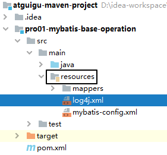

[TOC]

# 第二节 HelloWorld强化

## 1、加入日志

### ①目的

在Mybatis工作过程中，通过打印日志的方式，将要执行的SQL语句打印出来。


### ②操作

#### [1]加入依赖

```xml
<!-- log4j日志 -->
<dependency>
    <groupId>log4j</groupId>
    <artifactId>log4j</artifactId>
    <version>1.2.17</version>
</dependency>
```


#### [2]加入log4j的配置文件



支持XML和properties属性文件两种形式。无论使用哪种形式，文件名是固定的：

- log4j.xml
- log4j.properties

```xml
<?xml version="1.0" encoding="UTF-8" ?>
<!DOCTYPE log4j:configuration SYSTEM "log4j.dtd">
    
<log4j:configuration xmlns:log4j="http://jakarta.apache.org/log4j/">
    
    <appender name="STDOUT" class="org.apache.log4j.ConsoleAppender">
        <param name="Encoding" value="UTF-8" />
        <layout class="org.apache.log4j.PatternLayout">
            <param name="ConversionPattern" value="%-5p %d{MM-dd HH:mm:ss,SSS} %m  (%F:%L) \n" />
        </layout>
    </appender>
    <logger name="java.sql">
        <level value="debug" />
    </logger>
    <logger name="org.apache.ibatis">
        <level value="info" />
    </logger>
    <root>
        <level value="debug" />
        <appender-ref ref="STDOUT" />
    </root>
</log4j:configuration>
```


### ③日志的级别

FATAL(致命)>ERROR(错误)>WARN(警告)>INFO(信息)>DEBUG(调试)<br/>

从左到右打印的内容越来越详细


### ④STDOUT

是standard output的缩写，意思是标准输出。对于Java程序来说，打印到标准输出就是打印到控制台。


### ⑤打印效果

> DEBUG 05-24 18:51:13,331 ==>  Preparing: select emp_id empId,emp_name empName,emp_salary empSalary from t_emp where emp_id=?  (BaseJdbcLogger.java:137) 
> DEBUG 05-24 18:51:13,371 ==> Parameters: 1(Integer)  (BaseJdbcLogger.java:137) 
> DEBUG 05-24 18:51:13,391 <==      Total: 1  (BaseJdbcLogger.java:137) 
> o = Employee{empId=1, empName='tom', empSalary=200.33}


## 2、关联外部属性文件

### ①需求

在实际开发时，同一套代码往往会对应多个不同的具体服务器环境。使用的数据库连接参数也不同。为了更好的维护这些信息，我们建议把数据库连接信息提取到Mybatis全局配置文件外边。


### ②做法

创建jdbc.properties配置文件

```properties
wechat.dev.driver=com.mysql.jdbc.Driver
wechat.dev.url=jdbc:mysql://192.168.198.100:3306/mybatis-example
wechat.dev.username=root
wechat.dev.password=atguigu
    
wechat.test.driver=com.mysql.jdbc.Driver
wechat.test.url=jdbc:mysql://192.168.198.150:3306/mybatis-example
wechat.test.username=root
wechat.test.password=atguigu
    
wechat.product.driver=com.mysql.jdbc.Driver
wechat.product.url=jdbc:mysql://192.168.198.200:3306/mybatis-example
wechat.product.username=root
wechat.product.password=atguigu
```


在Mybatis全局配置文件中指定外部jdbc.properties文件的位置

```xml
<properties resource="jdbc.properties"/>
```


在需要具体属性值的时候使用${key}格式引用属性文件中的键

```xml
<dataSource type="POOLED">
    
    <!-- 建立数据库连接的具体信息（引用了外部属性文件中的数据） -->
    <property name="driver" value="${wechat.dev.driver}"/>
    <property name="url" value="${wechat.dev.url}"/>
    <property name="username" value="${wechat.dev.username}"/>
    <property name="password" value="${wechat.dev.password}"/>
    
</dataSource>
```


## 3、用上Mapper接口

Mybatis中的Mapper接口相当于以前的Dao。但是区别在于，Mapper仅仅是接口，我们不需要提供实现类。


### ①思路


### ②调整junit代码

```java
public class PromotedMybatisTest {
    
    private SqlSessionFactory sessionFactory;
    
    @Before
    public void init() throws IOException {
        // 1.创建SqlSessionFactory对象
        // ①声明Mybatis全局配置文件的路径
        String mybatisConfigFilePath = "mybatis-config.xml";
    
        // ②以输入流的形式加载Mybatis配置文件
        InputStream inputStream = Resources.getResourceAsStream(mybatisConfigFilePath);
    
        // ③基于读取Mybatis配置文件的输入流创建SqlSessionFactory对象
        sessionFactory = new SqlSessionFactoryBuilder().build(inputStream);
    
    }

    @Test
    public void testSelectEmployee() throws IOException {
    
        SqlSession session = sessionFactory.openSession();
    
        
    
        session.close();
    }
    
}
```


### ③完成Mapper接口

```java
public interface EmployeeMapper {
    
    Employee selectEmployee(Integer empId);
        
}
```

- 方法名和SQL的id一致
- 方法返回值和resultType一致
- 方法的参数和SQL的参数一致
- 接口的全类名和映射配置文件的名称空间一致


### ④最终的junit测试方法

```java
@Test
public void testSelectEmployee() throws IOException {
    
    // 1.从工厂对象中获取SqlSession对象
    SqlSession session = sessionFactory.openSession();
    
    // 2.通过SqlSession对象获取Mapper接口对象
    EmployeeMapper employeeMapper = session.getMapper(EmployeeMapper.class);
    
    // 3.调用Mapper接口的方法
    Employee employee = employeeMapper.selectEmployee(1);
    
    // 4.打印返回值
    System.out.println("employee = " + employee);
    
    // 5.关闭Session
    session.close();
}
```


## 10、增删改操作

### ①insert

SQL语句

```xml
<insert id="insertEmployee">
    insert into t_emp(emp_name,emp_salary) values(#{empName},#{empSalary})
</insert>
```


Java代码中的Mapper接口：

```java
public interface EmployeeMapper {
    
    Employee selectEmployee(Integer empId);
    
    int insertEmployee(Employee employee);
}
```


Java代码中的junit测试：

```java
@Test
public void testSaveEmployee() {
    
    SqlSession session = sessionFactory.openSession();
    
    EmployeeMapper employeeMapper = session.getMapper(EmployeeMapper.class);
    
    // 创建要保存到数据库的对象
    Employee employee = new Employee();
    
    // 给实体类对象设置具体属性值
    employee.setEmpName("jerry");
    employee.setEmpSalary(5000.33);
    
    // 执行保存操作
    int result = employeeMapper.insertEmployee(employee);
    
    // 打印受影响的行数
    System.out.println("result = " + result);
    
    // 提交事务
    session.commit();
    
    session.close();
}
```


### ②delete

SQL语句

```xml
    <delete id="deleteEmployee">
        delete from t_emp where emp_id=#{empId}
    </delete>
```


Java代码中的Mapper接口：

```java
public interface EmployeeMapper {
    
    Employee selectEmployee(Integer empId);
    
    int insertEmployee(Employee employee);
    
    int deleteEmployee(Integer empId);
}
```


Java代码中的junit测试：

```java
@Test
public void testRemoveEmployee() {
    SqlSession session = sessionFactory.openSession();
    
    EmployeeMapper employeeMapper = session.getMapper(EmployeeMapper.class);
    
    int result = employeeMapper.deleteEmployee(1);
    
    System.out.println("result = " + result);
    
    session.commit();
    
    session.close();
}
```


### ③update

SQL语句：

```xml
<update id="updateEmployee">
    update t_emp set emp_name=#{empName},emp_salary=#{empSalary} where emp_id=#{empId}
</update>
```


Java代码中的Mapper接口：

```java
public interface EmployeeMapper {
    
    Employee selectEmployee(Integer empId);
    
    int insertEmployee(Employee employee);
    
    int deleteEmployee(Integer empId);
    
    int updateEmployee(Employee employee);
}
```


Java代码中的junit测试：

```java
@Test
public void testUpdateEmployee() {
    SqlSession session = sessionFactory.openSession();
    
    EmployeeMapper employeeMapper = session.getMapper(EmployeeMapper.class);
    
    Employee employee = new Employee(2, "AAAAAA", 6666.66);
    
    int result = employeeMapper.updateEmployee(employee);
    
    System.out.println("result = " + result);
    
    session.commit();
    
    session.close();
}
```


[上一节](verse01.html) [回目录](index.html) [下一节](verse03.html)