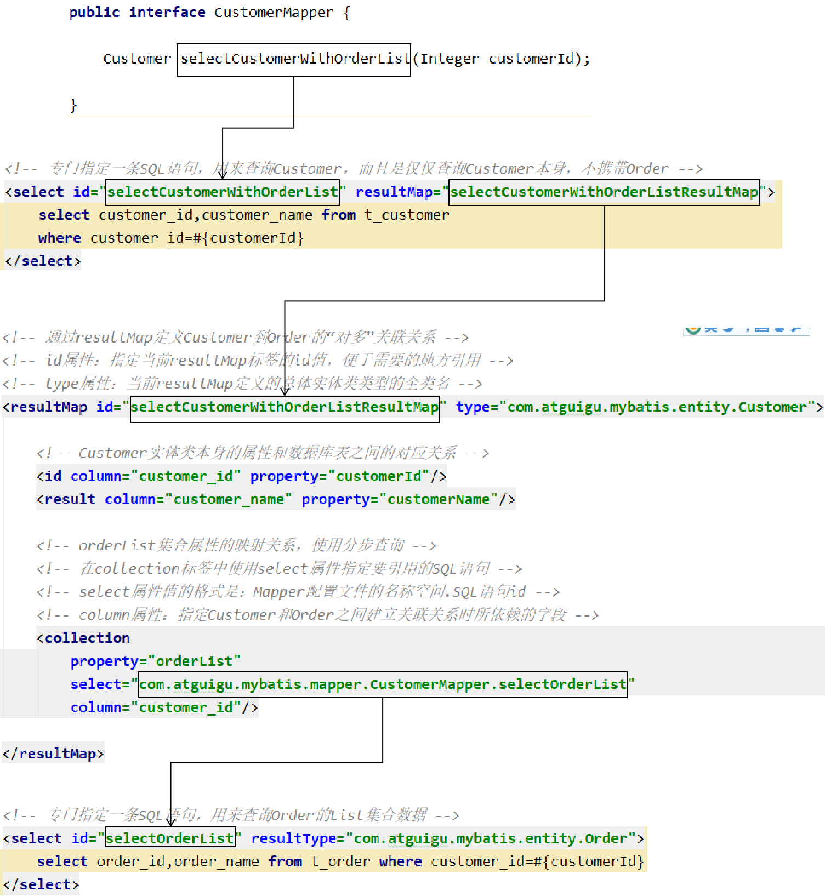

[TOC]

# 第四节 分步查询


## 1、概念和需求

为了实现延迟加载，对Customer和Order的查询必须分开，分成两步来做，才能够实现。为此，我们需要单独查询Order，也就是需要在Mapper配置文件中，单独编写查询Order集合数据的SQL语句。


## 2、具体操作

### ①编写查询Customer的SQL语句

```xml
<!-- 专门指定一条SQL语句，用来查询Customer，而且是仅仅查询Customer本身，不携带Order -->
<select id="selectCustomerWithOrderList" resultMap="selectCustomerWithOrderListResultMap">
    select customer_id,customer_name from t_customer
    where customer_id=#{customerId}
</select>
```


### ②编写查询Order的SQL语句

```xml
<select id="selectOrderList" resultType="com.atguigu.mybatis.entity.Order">
    select order_id,order_name from t_order where customer_id=#{customer_id}
</select>
```


### ③引用SQL语句

```xml
<!-- orderList集合属性的映射关系，使用分步查询 -->
<!-- 在collection标签中使用select属性指定要引用的SQL语句 -->
<!-- select属性值的格式是：Mapper配置文件的名称空间.SQL语句id -->
<!-- column属性：指定Customer和Order之间建立关联关系时所依赖的字段 -->
<collection
    property="orderList"
    select="com.atguigu.mybatis.mapper.CustomerMapper.selectOrderList"
    column="customer_id"/>
```


如果Mapper接口中的抽象方法没有改变，那么juni测试也不变。执行结果如下：

```java
DEBUG 11-30 11:10:05,796 ==>  Preparing: select customer_id,customer_name from t_customer where customer_id=?   (BaseJdbcLogger.java:145) 
DEBUG 11-30 11:10:05,866 ==> Parameters: 1(Integer)  (BaseJdbcLogger.java:145) 
DEBUG 11-30 11:10:05,889 ====>  Preparing: select order_id,order_name from t_order where customer_id=?   (BaseJdbcLogger.java:145) 
DEBUG 11-30 11:10:05,890 ====> Parameters: 1(Integer)  (BaseJdbcLogger.java:145) 
DEBUG 11-30 11:10:05,895 <====      Total: 3  (BaseJdbcLogger.java:145) 
DEBUG 11-30 11:10:05,896 <==      Total: 1  (BaseJdbcLogger.java:145) 
customer = c01
order = Order{orderId=1, orderName='o1'}
order = Order{orderId=2, orderName='o2'}
order = Order{orderId=3, orderName='o3'}
```


### ④各个要素之间的对应关系




[上一节](verse03.html) [回目录](index.html) [下一节](verse05.html)