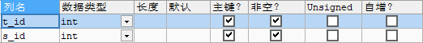

[TOC]

# 第六节 多对多关联关系需要中间表

## 1、如果不使用中间表

在某一个表中，使用一个字段保存多个“外键”值，这将导致无法使用SQL语句进行关联查询。

## 2、使用中间表

这样就可以使用SQL进行关联查询了。只是有可能需要三张表进行关联。

## 3、中间表设置主键

### ①方案一：另外设置一个专门的主键字段

### ②方案二：使用联合主键

使用联合主键时，只要多个字段的组合不重复即可，单个字段内部是可以重复的。

[上一节](verse05.html) [回目录](index.html)